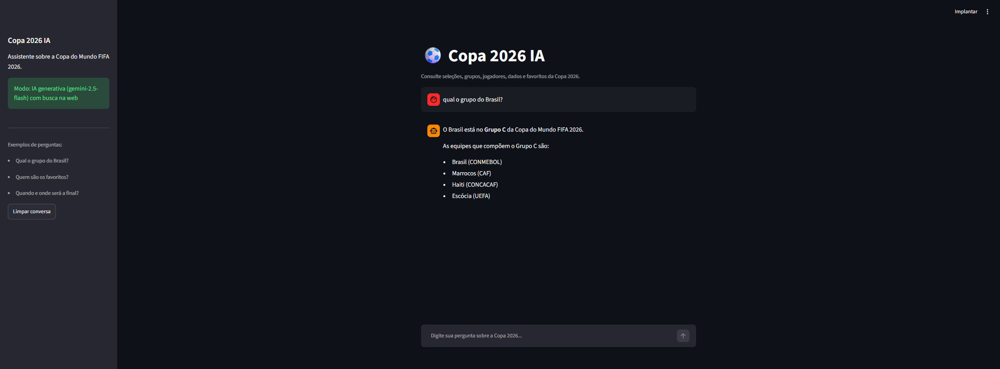
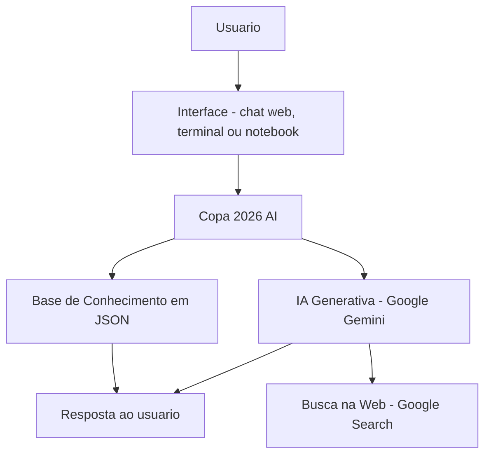

# ⚽ Copa 2026 AI - Assistente Virtual da Copa do Mundo

> Assistente de IA generativa que responde dúvidas sobre a Copa do Mundo FIFA 2026 usando uma base de conhecimento e busca na web, de forma clara e sem inventar informações.

## 🤖 O Que é o Copa 2026 AI?

O Copa 2026 AI é um assistente virtual que ajuda torcedores e curiosos a encontrar, num lugar só, informações sobre a Copa do Mundo de 2026: grupos, seleções, jogadores, datas e favoritos. Ele entende a pergunta em linguagem natural e responde com base em informações organizadas, priorizando a confiabilidade.

**O que ele faz:**

- ✅ Responde sobre grupos, seleções, jogadores, datas e favoritos
- ✅ Usa a base de conhecimento como fonte principal
- ✅ Busca na web em tempo real quando a pergunta foge da base
- ✅ Avisa quando não tem a informação, em vez de chutar

**O que ele NÃO faz:**

- ❌ Não inventa dados, estatísticas ou resultados
- ❌ Não crava um campeão como se fosse previsão certa
- ❌ Não favorece nenhuma seleção

## 📸 Demonstração



## 🏗️ Arquitetura



**Stack:**

- Interface: Streamlit (chat web), terminal e Jupyter Notebook
- IA: Google Gemini (modelo `gemini-2.5-flash`) com busca na web
- Dados: base de conhecimento em JSON
- Linguagem: Python 3.9+

## 📁 Estrutura do Projeto

```
assistente-copa-2026/
├── README.md
├── PITCH.md                       # Roteiro do pitch de 3 minutos
├── requirements.txt               # Dependencias do projeto
├── .env.example                   # Modelo para a chave de API
├── demo_notebook.ipynb            # Demonstracao interativa no Jupyter
│
├── data/
│   └── base_conhecimento.json     # Base de dados da Copa 2026
│
├── docs/
│   ├── DOCUMENTACAO.md            # Documentacao tecnica e arquitetura
│   ├── PROMPTS.md                 # Prompts e regras de resposta
│   └── METRICAS.md                # Avaliacao e metricas
│
├── assets/
│   └── demo.png                   # Imagem do projeto rodando
│
└── src/
    ├── app.py                     # Chat web (Streamlit)
    ├── assistente.py              # Logica principal do assistente
    └── utils.py                   # Funcoes auxiliares
```

## 🚀 Como Executar

### 1. Instalar dependências

```bash
pip install -r requirements.txt
```

### 2. (Opcional) Ativar a IA generativa

Pegue uma chave gratuita do Google Gemini em https://aistudio.google.com/apikey, copie `.env.example` para `.env` e preencha:

```
GEMINI_API_KEY=sua-chave-aqui
```

Sem essa chave, o assistente roda em modo de busca local (sem IA, mas funcional).

### 3. Rodar o assistente

```bash
# Chat web (recomendado)
streamlit run src/app.py

# Terminal
python src/assistente.py

# Notebook no navegador
jupyter notebook demo_notebook.ipynb
```

## 💬 Exemplo de Uso

**Pergunta:** "Qual o grupo do Brasil?"
**Copa 2026 AI:** "O Brasil está no Grupo C da Copa 2026, com Marrocos, Haiti e Escócia."

**Pergunta:** "Quando e onde será a final?"
**Copa 2026 AI:** "A final será em 19 de julho de 2026, no MetLife Stadium, em Nova Jersey."

**Pergunta:** "Quem é o técnico atual da seleção brasileira?"
**Copa 2026 AI:** "Carlo Ancelotti é o atual técnico do Brasil." (essa informação não está na base; o assistente busca na web e cita a fonte)

## 📊 Métricas de Avaliação

| Métrica | Objetivo |
|---------|----------|
| Assertividade | A resposta corresponde ao que foi perguntado? |
| Segurança | Evita inventar informações (anti-alucinação)? |
| Atualidade | Busca na web quando a base não tem o dado? |
| Clareza | A resposta é simples e fácil de entender? |

Os casos de teste completos estão em [docs/METRICAS.md](docs/METRICAS.md).

## 🏆 Diferenciais

- **Dados reais:** base com os 12 grupos oficiais e as 48 seleções da Copa 2026
- **IA generativa:** o Google Gemini entende a pergunta em linguagem natural
- **Busca na web:** quando a pergunta foge da base, responde com dado atual e cita a fonte
- **Anti-alucinação:** usa a base como fonte, admite quando não sabe e não inventa
- **Funciona sem IA:** modo local de fallback, roda offline e sem chave de API

## 📄 Documentação Completa

Toda a documentação técnica, os prompts, as métricas e o pitch estão na pasta [docs/](docs/) e em [PITCH.md](PITCH.md).

## 👤 Autor

**Jacielio (Cielio) Queiroz**

Projeto desenvolvido para o Desafio Final da DIO, Trilha Bradesco Dados, Cibersegurança e GenAI.
